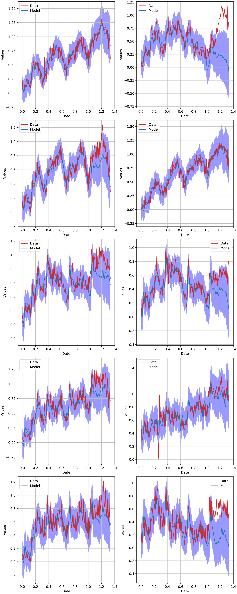

# Sorcerer

**Sorcerer** is a hierarchical Bayesian Generalized Additive Model (GAM) for time series forecasting, inspired by [timeseers](https://github.com/MBrouns/timeseers) and the [PyMC model builder class](https://www.pymc.io/projects/examples/en/latest/howto/model_builder.html). Like **timeseers**, **Sorcerer** builds upon the ideas from Facebook's [Prophet](https://facebook.github.io/prophet/), aiming to provide a Bayesian framework for forecasting multiple time series with shared parameters simultaneously.

However, **Sorcerer** extends beyond what existing tools offer by focusing on two key enhancements:

1. **Version Control and Compatibility for Multivariate Models**: Sorcerer introduces a model version control approach inspired by PyMC's model builder, but adapted to work with the multivariate time series cases that PyMC's original class does not handle.
   
2. **Novel Approach to Shared Seasonalities**: Sorcerer takes a novel approach to shared seasonalities, in which there is a user-specified set of shared seasonalities that each time series can opt into (or not). The shared seasonalities are collectively learned from data and simultaneously it is learned which time series opt into which of the shared seasonalities.

By combining these innovations, **Sorcerer** aims to offer a more comprehensive and scalable solution for time series forecasting, while retaining the interpretability and flexibility of a Bayesian framework.


# Usage

## Load data
```python
import numpy as np
import arviz as az
import matplotlib.pyplot as plt
from sorcerer.sorcerer_model import SorcererModel

from examples.load_data import load_m5_weekly_store_category_sales_data

_,df,_ = load_m5_weekly_store_category_sales_data()

```

## Define model
```python
model_name = "SorcererModel"
model_version = "v0.3.1"
forecast_horizon = 30

training_data = df.iloc[:-forecast_horizon]
test_data = df.iloc[-forecast_horizon:]

# Sorcerer
sampler_config = {
    "draws": 500,
    "tune": 200,
    "chains": 1,
    "cores": 1,
    "sampler": "NUTS",
    "verbose": True
}

number_of_weeks_in_a_year = 52.1429

model_config = {
    "number_of_individual_trend_changepoints": 40,
    "delta_mu_prior": 0,
    "delta_b_prior": 0.1,
    "m_sigma_prior": 0.2,
    "k_sigma_prior": 0.2,
    "fourier_mu_prior": 0,
    "fourier_sigma_prior" : 1,
    "precision_target_distribution_prior_alpha": 1000,
    "precision_target_distribution_prior_beta": 0.1,
    "prior_probability_shared_seasonality_alpha": 1,
    "prior_probability_shared_seasonality_beta": 1,
    "individual_fourier_terms": [
        {'seasonality_period_baseline': number_of_weeks_in_a_year,'number_of_fourier_components': 20}
    ],
    "shared_fourier_terms": [
        {'seasonality_period_baseline': number_of_weeks_in_a_year,'number_of_fourier_components': 10},
        {'seasonality_period_baseline': number_of_weeks_in_a_year/4,'number_of_fourier_components': 1},
        {'seasonality_period_baseline': number_of_weeks_in_a_year/12,'number_of_fourier_components': 1},
    ]
}

sorcerer = SorcererModel(
    model_config = model_config,
    model_name = model_name,
    model_version = model_version
    )
```

## Fit model
```python
sorcerer.fit(
    training_data = training_data,
    sampler_config = sampler_config
    )

```

```python
Sequential sampling (1 chains in 1 job)
CompoundStep
>NUTS: [linear_k, linear_delta, linear_m, fourier_coefficients_seasonality_individual_52.14, fourier_coefficients_seasonality_shared_52.14, fourier_coefficients_seasonality_shared_13.04, fourier_coefficients_seasonality_shared_4.35, prior_probability_shared_seasonality, precision_target_distribution]
>BinaryGibbsMetropolis: [include_seasonality]
Sampling chain 0, 0 divergences ━━━━━━━━━━━━━━━━━━━━━━━━━━━━━━━━━━━━━━━━ 100% 0:00:00 / 0:07:23
Sampling 1 chain for 200 tune and 500 draw iterations (200 + 500 draws total) took 443 seconds.
Chain 0 reached the maximum tree depth. Increase `max_treedepth`, increase `target_accept` or reparameterize.
Only one chain was sampled, this makes it impossible to run some convergence checks
```

## Produce forecasts
```python
(preds_out_of_sample, model_preds) = sorcerer.sample_posterior_predictive(test_data = test_data)
```

```python
Sampling: [target_distribution]
Sampling ... ━━━━━━━━━━━━━━━━━━━━━━━━━━━━━━━━━━━━━━━━ 100% 0:00:00 / 0:00:00
```

## Plot forecasts along with test and training data
```python
(X_train, y_train, X_test, y_test) = sorcerer.normalize_data(
        training_data,
        test_data
        )
column_names = [x for x in df.columns if 'HOUSEHOLD' in x]

hdi_values = az.hdi(model_preds)["target_distribution"].transpose("hdi", ...)

n_cols = 2
n_rows = int(np.ceil(len(column_names) / n_cols))  # Number of rows needed
fig, axs = plt.subplots(nrows=n_rows, ncols=n_cols, figsize=(15, 5 * n_rows), constrained_layout=True)
axs = axs.flatten()
for i in range(len(column_names)):
    ax = axs[i]
    ax.plot(X_train, y_train[y_train.columns[i]], color = 'tab:red',  label='Training Data')
    ax.plot(X_test, y_test[y_test.columns[i]], color = 'black',  label='Test Data')
    ax.plot(preds_out_of_sample, (model_preds["target_distribution"].mean(("chain", "draw")).T)[i], color = 'tab:blue', label='Model')
    ax.fill_between(
        preds_out_of_sample.values,
        hdi_values[0].values[:,i],
        hdi_values[1].values[:,i],
        color= 'blue',
        alpha=0.4
    )
    ax.set_title(column_names[i])
    ax.set_xlabel('Date')
    ax.set_ylabel('Values')
    ax.grid(True)
    ax.legend()
```

