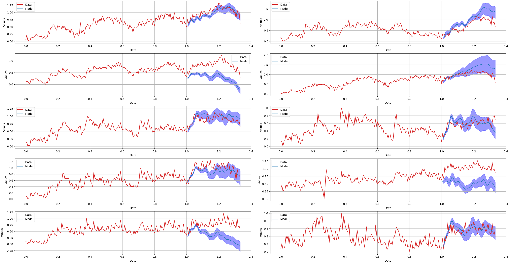

# Sorcerer

**Sorcerer** is a hierarchical Bayesian Generalized Additive Model (GAM) for time series forecasting, inspired by [timeseers](https://github.com/MBrouns/timeseers) and the [PyMC model builder class](https://www.pymc.io/projects/examples/en/latest/howto/model_builder.html). Like **timeseers**, **Sorcerer** builds upon the ideas from Facebook's [Prophet](https://facebook.github.io/prophet/), aiming to provide a Bayesian framework for forecasting multiple time series with shared parameters simultaneously.

However, **Sorcerer** extends beyond what existing tools offer by focusing on two key enhancements:

1. **Version Control and Compatibility for Multivariate Models**: Sorcerer introduces a model version control approach inspired by PyMC's model builder, but adapted to work with the multivariate time series cases that PyMC's original class does not handle.
   
2. **Automatic Learning of Periodicity**: Unlike existing models, which often require manually defined periodic components, Sorcerer learns the periodicity directly from the training data, providing a more flexible and data-driven approach to forecasting.

By combining these innovations, **Sorcerer** aims to offer a more comprehensive and scalable solution for time series forecasting, while retaining the interpretability and flexibility of a Bayesian framework.


# Usage

## Load data
```python
import numpy as np
import matplotlib.pyplot as plt
import arviz as az

from src.load_data import normalized_weekly_store_category_household_sales
from src.sorcerer_model2 import SorcererModel

df = normalized_weekly_store_category_household_sales()

```

## Ensure format
```python
n_weeks = 52
normalized_column_group = [x for x in df.columns if '_normalized' in x ]
unnormalized_column_group = [x for x in df.columns if 'HOUSEHOLD' in x and 'normalized' not in x]

training_data = df.iloc[:-n_weeks]
test_data = df.iloc[-n_weeks:]
```

## Feature engineering
```python

x_train = (training_data['date'].astype('int64')//10**9 - (training_data['date'].astype('int64')//10**9).min())/((training_data['date'].astype('int64')//10**9).max() - (training_data['date'].astype('int64')//10**9).min())
y_train = (training_data[unnormalized_column_group]-training_data[unnormalized_column_group].min())/(training_data[unnormalized_column_group].max()-training_data[unnormalized_column_group].min())

x_test = (test_data['date'].astype('int64')//10**9 - (training_data['date'].astype('int64')//10**9).min())/((training_data['date'].astype('int64')//10**9).max() - (training_data['date'].astype('int64')//10**9).min())
y_test = (test_data[unnormalized_column_group]-training_data[unnormalized_column_group].min())/(training_data[unnormalized_column_group].max()-training_data[unnormalized_column_group].min())

x_total = (df['date'].astype('int64')//10**9 - (training_data['date'].astype('int64')//10**9).min())/((training_data['date'].astype('int64')//10**9).max() - (training_data['date'].astype('int64')//10**9).min())
y_total = (df[unnormalized_column_group]-training_data[unnormalized_column_group].min())/(training_data[unnormalized_column_group].max()-training_data[unnormalized_column_group].min())
```

## Define model

```python
sampler_config = {
    "draws": 1_000,
    "tune": 200,
    "chains": 1,
    "cores": 1,
    "target_accept": 0.95,
}

model_config = {
    "forecast_horizon": 0.5,
    "target_standard_deviation": 0.01,
    "number_of_individual_trend_changepoints": 20,
    "number_of_individual_fourier_components": 10,
    "period_threshold": 0.5,
    "number_of_shared_seasonality_groups": 3,
    "delta_mu_prior": 0,
    "delta_b_prior": 0.4,
    "m_sigma_prior": 1,
    "k_sigma_prior": 1,
    "relative_uncertainty_factor_prior": 1000

}

sorcerer = SorcererModel(
    sampler_config = sampler_config,
    model_config = model_config
    )
```

## Fit model
```python
sorcerer.fit(
    X = x_train,
    y = y_train,
    step="NUTS"
    )

Sequential sampling (1 chains in 1 job)
CompoundStep
>NUTS: [linear1_k, linear1_delta, linear1_m, fourier_coefficients_seasonality_individual1, season_parameter_seasonality_individual1, fourier_coefficients_seasonality_shared, season_parameter_seasonality_shared, model_probs]
>CategoricalGibbsMetropolis: [chosen_model_index]
Sampling chain 0, 0 divergences ------------------------ 100% 0:00:00 / 0:10:08
[?25hSampling 1 chain for 200 tune and 1_000 draw iterations (200 + 1_000 draws total) took 609 seconds.
Chain 0 reached the maximum tree depth. Increase `max_treedepth`, increase `target_accept` or reparameterize.
Only one chain was sampled, this makes it impossible to run some convergence checks
```

## Produce forecasts
```python
(preds_out_of_sample, model_preds) = sorcerer.sample_posterior_predictive(X_pred = x_test)

Sampling: [target_distribution]
Sampling ... ---------------------------------------- 100% 0:00:00 / 0:00:00
[?25h
```

## Plot forecasts along with test and training data
```python
hdi_values = az.hdi(model_preds)["target_distribution"].transpose("hdi", ...)

# Calculate the number of rows needed for 2 columns
n_cols = 2  # We want 2 columns
n_rows = int(np.ceil(y_test.shape[1] / n_cols))  # Number of rows needed

# Create subplots with 2 columns and computed rows
fig, axs = plt.subplots(nrows=n_rows, ncols=n_cols, figsize=(10, 5 * n_rows), constrained_layout=True)

# Flatten the axs array to iterate over it easily
axs = axs.flatten()

# Loop through each column to plot
for i in range(y_test.shape[1]):
    ax = axs[i]  # Get the correct subplot
    ax.plot(x_total, y_total[y_total.columns[i]], color = 'tab:red',  label='Training Data')
    ax.plot(preds_out_of_sample, (model_preds["target_distribution"].mean(("chain", "draw")).T)[i], color = 'tab:blue', label='Model')
    ax.fill_between(
        preds_out_of_sample.values,
        hdi_values[0].values[:,i],  # lower bound of the HDI
        hdi_values[1].values[:,i],  # upper bound of the HDI
        color= 'blue',   # color of the shaded region
        alpha=0.4,      # transparency level of the shaded region
    )
    ax.set_xlabel('Date')
    ax.set_ylabel('Values')
    ax.grid(True)
    ax.legend()

# Hide any remaining empty subplots
for j in range(i + 1, len(axs)):
    fig.delaxes(axs[j])  # Remove unused axes to clean up the figure

```

