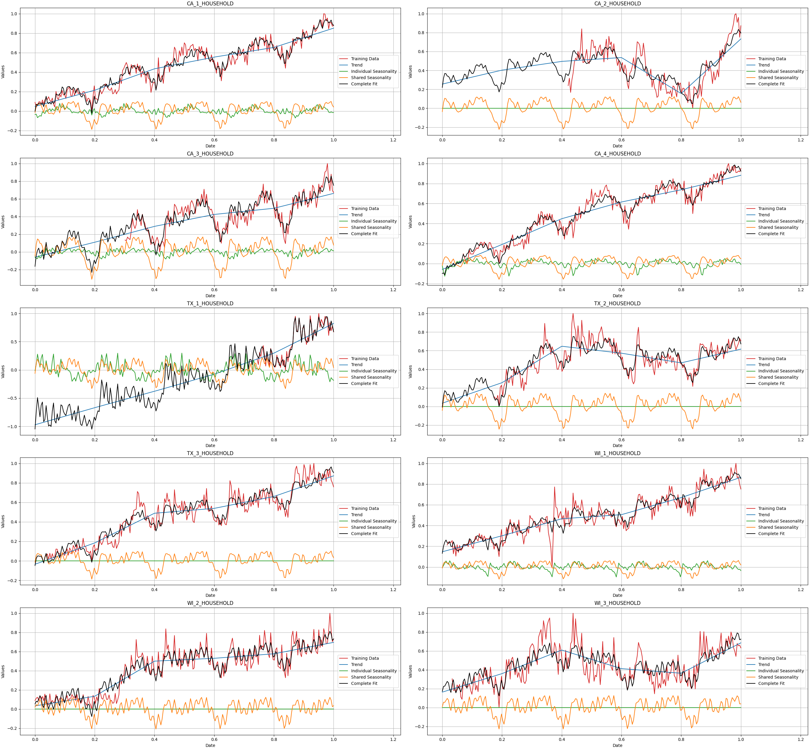

# Sorcerer

**Sorcerer** is a hierarchical Bayesian Generalized Additive Model (GAM) for time series forecasting, inspired by [timeseers](https://github.com/MBrouns/timeseers) and the [PyMC model builder class](https://www.pymc.io/projects/examples/en/latest/howto/model_builder.html). Like **timeseers**, **Sorcerer** builds upon the ideas from Facebook's [Prophet](https://facebook.github.io/prophet/), aiming to provide a Bayesian framework for forecasting multiple time series with shared parameters simultaneously.

However, **Sorcerer** extends beyond what existing tools offer by focusing on two key enhancements:

1. **Version Control and Compatibility for Multivariate Time Series Forecasting**: Sorcerer introduces a model version control approach inspired by PyMC's model builder, but adapted to work with the multivariate time series cases that PyMC's original class does not handle.
   
2. **Novel Approach to Shared Seasonalities**: Sorcerer takes a novel approach to shared seasonalities, in which there is a user-specified set of shared seasonalities that each time series can opt into (or not). The shared seasonalities are collectively learned from data and simultaneously it is learned which time series opt into which of the shared seasonalities.

By combining these innovations, **Sorcerer** aims to offer a more comprehensive and scalable solution for time series forecasting, while retaining the interpretability and flexibility of a Bayesian framework.


# Usage

## Load data
```python
import numpy as np
import arviz as az
import matplotlib.pyplot as plt
from sorcerer.sorcerer_model import SorcererModel

from examples.load_data import load_m5_weekly_store_category_sales_data

_,df,_ = load_m5_weekly_store_category_sales_data()

"""
Note:
    Below a random amount is deleted from the beginning of
    each time series. This is done to simulate that the time
    series begin at different points in time.
    The model treats the deleted datapoints as missing and
    imputes them. This way the model trivially accounts for
    values missing between the first and last time stamps as
    well. This feature is the root of the imputation warning
    when calling .fit(); it occurs iff a subset of data is 
    missing.
"""
nan_count = [0, 102, 73, 17, 180, 42, 9, 4, 0, 8] 
time_series_column_group = [x for x in df.columns if 'HOUSEHOLD' in x]

for col, n in zip(time_series_column_group, nan_count):
    df.loc[:n-1, col] = np.nan

```

## Define model
```python
model_name = "SorcererModel"
model_version = "v0.4.1"
forecast_horizon = 30

training_data = df.iloc[:-forecast_horizon]
test_data = df.iloc[-forecast_horizon:]

# Sorcerer
sampler_config = {
    "draws": 2000,
    "tune": 500,
    "chains": 1,
    "cores": 1,
    "sampler": "NUTS",
    "verbose": True,
    "nuts_sampler": "numpyro"
}

number_of_weeks_in_a_year = 52.1429

model_config = {
    "number_of_individual_trend_changepoints": 40,
    "delta_mu_prior": 0,
    "delta_b_prior": 0.1,
    "m_sigma_prior": 0.2,
    "k_sigma_prior": 0.2,
    "fourier_mu_prior": 0,
    "fourier_sigma_prior" : 1,
    "precision_target_distribution_prior_alpha": 50,
    "precision_target_distribution_prior_beta": 0.1,
    "prior_probability_shared_seasonality_alpha": 1,
    "prior_probability_shared_seasonality_beta": 1,
    "individual_fourier_terms": [
        {'seasonality_period_baseline': number_of_weeks_in_a_year,'number_of_fourier_components': 10}
    ],
    "shared_fourier_terms": [
        {'seasonality_period_baseline': number_of_weeks_in_a_year,'number_of_fourier_components': 8},
        {'seasonality_period_baseline': number_of_weeks_in_a_year/4,'number_of_fourier_components': 2},
        {'seasonality_period_baseline': number_of_weeks_in_a_year/12,'number_of_fourier_components': 1},
    ]
}

sorcerer = SorcererModel(
    model_config = model_config,
    model_name = model_name,
    model_version = model_version
    )
```

## Fit model
```python
sorcerer.fit(
    training_data = training_data,
    sampler_config = sampler_config
    )

```

```python
ImputationWarning: Data in target_distribution contains missing values and will be automatically imputed from the sampling distribution.
  warnings.warn(impute_message, ImputationWarning)
sample: 100%|██████████████████████████| 2500/2500 [09:46<00:00,  4.26it/s, 511 steps of size 7.80e-03. acc. prob=0.88]
Only one chain was sampled, this makes it impossible to run some convergence checks
```

## Produce forecasts
```python
model_preds = sorcerer.sample_posterior_predictive(test_data = test_data)
```

```python
Sampling: [predictions]
Sampling ... ━━━━━━━━━━━━━━━━━━━━━━━━━━━━━━━━━━━━━━━━ 100% 0:00:00 / 0:00:00
```

## Plot forecasts along with test and training data
```python
(X_train, y_train, X_test, y_test) = sorcerer.normalize_data(
        training_data,
        test_data
        )
column_names = [x for x in df.columns if 'HOUSEHOLD' in x]

hdi_values = az.hdi(model_preds)["predictions"].transpose("hdi", ...)

n_cols = 2
n_rows = int(np.ceil(len(column_names) / n_cols))
fig, axs = plt.subplots(nrows=n_rows, ncols=n_cols, figsize=(15, 5 * n_rows), constrained_layout=True)
axs = axs.flatten()
for i in range(len(column_names)):
    ax = axs[i]
    ax.plot(X_train, y_train[y_train.columns[i]], color = 'tab:red',  label='Training Data')
    ax.plot(X_test, y_test[y_test.columns[i]], color = 'black',  label='Test Data')
    ax.plot(X_test, (model_preds["predictions"].mean(("chain", "draw")).T)[i], color = 'tab:blue', label='Model')
    ax.fill_between(
        X_test,
        hdi_values[0].values[:,i],
        hdi_values[1].values[:,i],
        color= 'blue',
        alpha=0.4
    )
    ax.set_title(column_names[i])
    ax.set_xlabel('Date')
    ax.set_ylabel('Values')
    ax.grid(True)
    ax.legend()
    ax.set_xlim([-0.05,max(X_test)+0.1])

```


## Plot model components for training data
```python
X_train, trend, seasonality_individual, shared_seasonality = sorcerer.get_mean_model_components()

n_cols = 2
n_rows = int(np.ceil(len(time_series_column_group) / n_cols))
fig, axs = plt.subplots(nrows=n_rows, ncols=n_cols, figsize=(27, 5 * n_rows), constrained_layout=True)
axs = axs.flatten()
for i in range(len(time_series_column_group)):
    ax = axs[i]
    ax.plot(X_train, Y_train[Y_train.columns[i]], color = 'tab:red',  label='Training Data')
    ax.plot(X_train, trend[:,i], color = 'tab:blue',  label='Trend')
    ax.plot(X_train, seasonality_individual[:,i], color = 'tab:green',  label='Individual Seasonality')
    ax.plot(X_train, shared_seasonality[:,i], color = 'tab:orange',  label='Shared Seasonality')
    ax.plot(X_train, trend[:,i]+seasonality_individual[:,i]+shared_seasonality[:,i], color = 'black',  label='Complete Fit')
    
    ax.set_title(time_series_column_group[i])
    ax.set_xlabel('Date')
    ax.set_ylabel('Values')
    ax.grid(True)
    ax.legend(loc = 'center right')
    ax.set_xlim([-0.05,max(X_test)+0.1])
```


## Plot model components for training data
```python
idata = sorcerer.get_idata()
individual_weights = idata.posterior["single_scale"].mean(('chain','draw')).values
shared_weights = idata.posterior["shared_scale"].mean(('chain','draw')).values

plt.figure(figsize = (20,10),constrained_layout=True)
plt.scatter(individual_weights, time_series_column_group, marker = 'o', label = "Individual seasonality weights (period mixture)")

for i, shared in enumerate(shared_weights):
    plt.scatter(shared, time_series_column_group, marker = 'o', label = f"Shared seasonality weights (period {round(model_config['shared_fourier_terms'][i]['seasonality_period_baseline'],2)})")

plt.xlabel('Scale')
plt.ylabel('Time series')
plt.grid(visible=True, which='both', linewidth=0.6, color='gray', alpha=0.7)
plt.legend()
```
