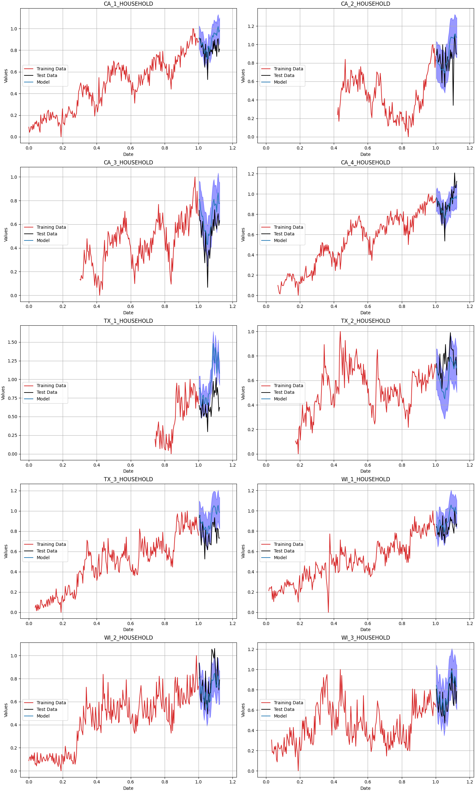

# Sorcerer

**Sorcerer** is a hierarchical Bayesian Generalized Additive Model (GAM) for time series forecasting, inspired by [timeseers](https://github.com/MBrouns/timeseers) and the [PyMC model builder class](https://www.pymc.io/projects/examples/en/latest/howto/model_builder.html). Like **timeseers**, **Sorcerer** builds upon the ideas from Facebook's [Prophet](https://facebook.github.io/prophet/), aiming to provide a Bayesian framework for forecasting multiple time series with shared parameters simultaneously.

However, **Sorcerer** extends beyond what existing tools offer by focusing on two key enhancements:

1. **Version Control and Compatibility for Multivariate Models**: Sorcerer introduces a model version control approach inspired by PyMC's model builder, but adapted to work with the multivariate time series cases that PyMC's original class does not handle.
   
2. **Automatic Learning of Periodicity**: Unlike existing models, which often require manually defined periodic components, Sorcerer learns the periodicity directly from the training data, providing a more flexible and data-driven approach to forecasting.

By combining these innovations, **Sorcerer** aims to offer a more comprehensive and scalable solution for time series forecasting, while retaining the interpretability and flexibility of a Bayesian framework.


# Usage

## Load data
```python
import numpy as np
import matplotlib.pyplot as plt
import arviz as az

from src.load_data import normalized_weekly_store_category_household_sales
from src.sorcerer_model2 import SorcererModel

df = normalized_weekly_store_category_household_sales()

```

## Define model
```python
n_weeks = 40
time_series_columns = [x for x in df.columns if ('HOUSEHOLD' in x and 'normalized' not in x) or ('date' in x)]

df_time_series = df[time_series_columns]
training_data = df_time_series.iloc[:-n_weeks]
test_data = df_time_series.iloc[-n_weeks:]


model_name = "SorcererModel"
version = "v0.1"
method = "NUTS"

sampler_config = {
    "draws": 2000,
    "tune": 500,
    "chains": 4,
    "cores": 1
}

model_config = {
    "test_train_split": len(training_data)/len(df),
    "number_of_individual_trend_changepoints": 20,
    "number_of_individual_fourier_components": 10,
    "number_of_shared_fourier_components": 5,
    "period_threshold": 0.5,
    "number_of_shared_seasonality_groups": 2,
    "delta_mu_prior": 0,
    "delta_b_prior": 0.3,
    "m_sigma_prior": 1,
    "k_sigma_prior": 1,
    "precision_target_distribution_prior_alpha": 2,
    "precision_target_distribution_prior_beta": 0.1,
    "relative_uncertainty_factor_prior": 1000
}

if method == "MAP":
    model_config['precision_target_distribution_prior_alpha'] = 100
    model_config['precision_target_distribution_prior_beta'] = 0.05
    

sorcerer = SorcererModel(
    sampler_config = sampler_config,
    model_config = model_config,
    model_name = model_name,
    version = version
    )
```

## Fit model
```python
seasonality_periods = np.array([52])

sorcerer.fit(
    training_data = training_data,
    seasonality_periods = seasonality_periods,
    method = method
    )

if method != "MAP":
    fname = "examples/models/sorcer_model_v02.nc"
    sorcerer.save(fname)
```

```python
Normalized periods: [0.30952381]
Sequential sampling (4 chains in 1 job)
CompoundStep
>NUTS: [linear_k, linear_delta, linear_m, fourier_coefficients_seasonality_individual_0.31, season_parameter_seasonality_individual_0.31, fourier_coefficients_seasonality_shared_0.31, season_parameter_seasonality_shared_0.31, model_probs, precision_target_distribution]
>CategoricalGibbsMetropolis: [chosen_model_index]
Sampling chain 0, 0 divergences ━━━━━━━━━━━━━━━━━━━━━━━━━━━━━━━━━━━━━━━━ 100% 0:00:00 / 0:11:44
Sampling chain 1, 0 divergences ━━━━━━━━━━━━━━━━━━━━━━━━━━━━━━━━━━━━━━━━ 100% 0:00:00 / 0:12:25
Sampling chain 2, 0 divergences ━━━━━━━━━━━━━━━━━━━━━━━━━━━━━━━━━━━━━━━━ 100% 0:00:00 / 0:12:33
Sampling chain 3, 0 divergences ━━━━━━━━━━━━━━━━━━━━━━━━━━━━━━━━━━━━━━━━ 100% 0:00:00 / 0:12:29
Sampling 4 chains for 500 tune and 2_000 draw iterations (2_000 + 8_000 draws total) took 2953 seconds.
The rhat statistic is larger than 1.01 for some parameters. This indicates problems during sampling. See https://arxiv.org/abs/1903.08008 for details
The effective sample size per chain is smaller than 100 for some parameters.  A higher number is needed for reliable rhat and ess computation. See https://arxiv.org/abs/1903.08008 for details
```

## Produce forecasts
```python
(preds_out_of_sample, model_preds) = sorcerer.sample_posterior_predictive(test_data = df_time_series)
```

```python
Sampling: [target_distribution]
Sampling ... ━━━━━━━━━━━━━━━━━━━━━━━━━━━━━━━━━━━━━━━━ 100% 0:00:00 / 0:00:02
```

## Plot forecasts along with test and training data
```python
(X_train, y_train, X_test, y_test) = sorcerer.normalize_data(
        training_data,
        test_data
        )

hdi_values = az.hdi(model_preds)["target_distribution"].transpose("hdi", ...)

# Calculate the number of rows needed for 2 columns
n_cols = 2  # We want 2 columns
n_rows = int(np.ceil((len(time_series_columns)-1) / n_cols))  # Number of rows needed

# Create subplots with 2 columns and computed rows   
fig, axs = plt.subplots(nrows=n_rows, ncols=n_cols, figsize=(15, 5 * n_rows), constrained_layout=True)

# Flatten the axs array to iterate over it easily
axs = axs.flatten()

# Loop through each column to plot
for i in range(len(time_series_columns)-1):
    ax = axs[i]  # Get the correct subplot
    
    ax.plot(X_train, y_train[y_train.columns[i]], color = 'tab:red',  label='Training Data')
    ax.plot(X_test, y_test[y_test.columns[i]], color = 'black',  label='Test Data')
    ax.plot(preds_out_of_sample, (model_preds["target_distribution"].mean(("chain", "draw")).T)[i], color = 'tab:blue', label='Model')
    ax.fill_between(
        preds_out_of_sample.values,
        hdi_values[0].values[:,i],  # lower bound of the HDI
        hdi_values[1].values[:,i],  # upper bound of the HDI
        color= 'blue',   # color of the shaded region
        alpha=0.4,      # transparency level of the shaded region
    )
    ax.set_xlabel('Date')
    ax.set_ylabel('Values')
    ax.grid(True)
    ax.legend()

# Hide any remaining empty subplots
for j in range(i + 1, len(axs)):
    fig.delaxes(axs[j])  # Remove unused axes to clean up the figure

```

